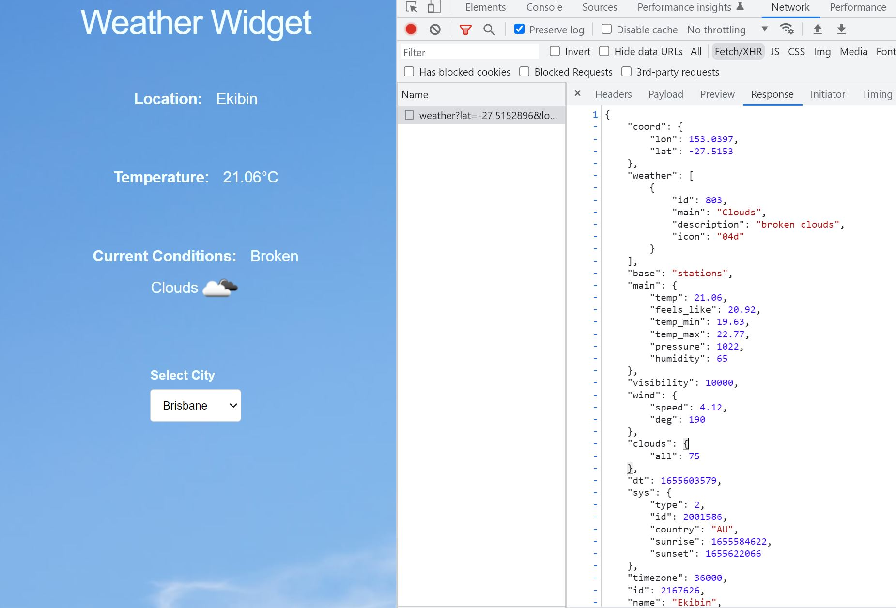

# Weather Widget

## Overview

This is a React based weather widget that provides live weather info for different locations.

**Weather info provided:**
  - Location
  - Temperature
  - Current Conditions and an Icon representing this condition visually

**Locations available:**
  - Brisbane
  - Melbourne
  - Sydney
  - The widget will default to Browsers location, if permission is granted.

The weather info is obtained from the free version of the [Open Weather API](https://openweathermap.org/api)

## Getting started

- Install dependencies with `npm install`
- Copy contents of `envrc.example` to a new file `.envrc` and set the required environment variables
  - `REACT_APP_API_OPEN_WEATHER_API_KEY` for weathermap (can be obtained from  [https://openweathermap.org/](weathermap). I can issue you my own API key securely if required.
  - `REACT_APP_API_OPEN_WEATHER_API_URL` (useful for dev/stage/prod environments) I have included this in the `envrc.example` file
- To start app run `npm run start`

## Testing
  - run `npm test` to run the unit tests

## Dependencies
  - Included in the project is `Normalize.css` and `Skeleton.css` for layout

## Potential future improvements
  - Latitude and Longitude for the 3 Cities are currently hard coded into a constants file. It would be nice to grab this information dynamically to allow lookup of any location by name 
  - Convert to Typescript for type safety and intellisense for API responses
  - ESlint/Prettier for better developer experience and confidence
  - Snapshot Tests and Cypress 

Please feel free to get in touch if you have any issues/questions.

Thanks!